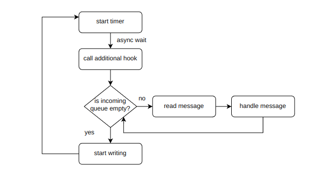

## How do the Client classes work???

The `BaseClient` constructor does a few things:

1. Initialize the acceptor (which accept connections) with that computers IP address and a designated port
2. Start the acceptor
3. `trap_signal` is supposed to trap SIGINT and SIGTERM, now it does nothing
4. `accept_socket()` starts accepting connections
5. start the repeating timer (see below)
6. start the IO context in a new thread

`accept_socket` does these things:

1. It calls `async_accept`, which asynchronously accepts connections. It
   receives a "token" (from the docs), which is a complicated name for
   "callback". Asynchronous means that this function will probably be called
   AFTER `accept_socket` pops off the stack. (Magic)

2. When it receives a connection, the token gives us a socket. Add that socket
   to the `peers` array. (so we can use it later)

3. Call `start_reading()` so we can start reading from that socket
4. INSIDE the callback, we call `accept_socket` again!! (this is NOT a recursion
   since it is asynchronous!!).

`connect_to_peer` does the opposite of `accept_socket`, it tries to connect to
others instead of others connecting to them.

1. Make a socket and add it to the peers list
2. Build a series of endpoints (the same host and service may correspond to
   multiple endpoints??)
3. Call `async_connect` with the endpoints
4. If none of the endpoints work, remove that socket
5. If it works, then it works.

`start_reading`:

1. It calls `async_read`, which tries to wait for something to read
2. First the header of the message is read. The header only contains what type
   of message it is (see `message-type.h`), and the size of body.
3. If it doesn't have a body, add the message to the `in_msgs` queue (see below
   on when this queue is read). Call `start_reading` again (this is NOT a
   recursion, again!)
4. If it has a body, call `read_body`. After that, push the message into the
   `in_msgs` queue. Call `start_reading` again.

`start_writing`:

It first checks if there are any messages in `out_msgs`, if not it quits.

1. It calls `async_write`, which tries to write to the socket
2. First we write the header
3. If body is empty, we quit (this time don't need to call `async_write`
   again, see `cycle` below)
4. If there is a body, call `write_body`
5. `write_body` will write the bytes to the message body, then quit.

`cycle`:

The timer is `async_timer`, which runs the "token" (callback) every N seconds,
now the interval is one second.

For each cycle, do the following:

1. Handle all messages in the `in_msgs` queue.
2. Calls `start_writing`

I don't know if this design is good or not, now each message will have a delay
of at least one second, but this is easiest I can think of.

## Interleaving Images

1. First the client announces that he wants the images, the peers responded with
   yes
2. As soon as a peer says yes, the client requests for the next segment. In the
   diagram above, peer one says yes first, so clients asks for the first
   segment.
3. Then peer two responded. Ask him for the second segment.
4. Ask peer three for segment two since he is the latest.
5. After a while, peer two responded with segment one, ask him for segment
   three.
6. Do this until the last segment is requested.

During the six phases, the program will see if there are any queued messages. If
yes, it will try to clear it.

### Interleaving Images Timeout

When a peer failed to respond for that segment after certain amount of seconds,
**drop** that segment and ask him for the next segment.

## What is a Message?

A message contains a header and body.

Header has two fields:

1. `MessageType`: type of message
2. `std::size_t`: size of body (zero if body is empty)

Body is just a vector of char.

The push something into the message body, use `<<`. To pull something out of the
message body, use `>>`. Note that the pushing is only a **shallow copy**. For
arrays and strings, and other composite types, a custom operator overloading has
to be provided for it to work correctly. See the `message.h` file for examples.

The message that is sent in the client is actually a `MessageWithOwner`. It is
nothing but message with a peer ID. Peer ID is a cleaner way to identify a peer
without using host, port and so on.

## So what is the difference between `BaseClient` and `Client`?

`BaseClient` dives into the details of reading and sending messages,
establishing connections etc. For handling messages, please use the
`handle_message` function in `Client`.

This `handle_message` is called for each message in `in_msgs`. The argument
passed in is `MessageWithOwner` so that the handler can see the client ID.

This handler can do whatever it wants, but most commonly it will scrutinize the
incoming message and construct a response. The response can be saved to the
`out_msgs` array by `push_message`. Note that the message will not be sent
immediately, it will be sent in the next cycle.
